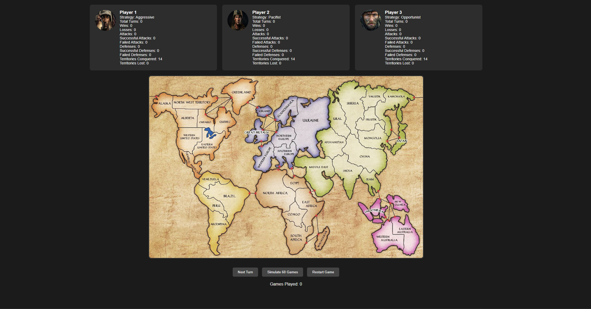

# Summary of Game
For this project, I chose to implement the game of Risk. Risk is a strategy game where the goal is to conquer
the world by occupying all territories. The 40K version of Risk I chose has a few slight differences from the
original game. Differences include a new game board, objective cards, reward cards, leader cards, territory cards,
and some other small changes. For the purposes of our experiment, i will be using a mix of the original Risk rules,
while implementing some of the notable additions in the 40K version (such as the unique factions, game board, and leaders/units).

<a href="https://boardgamegeek.com/thread/2577893/rules-online">40K Risk Rules</a>

<a href="https://www.hasbro.com/common/instruct/risk.pdf">Original Risk Rules</a>

# Experiment Report
## Player Strategies
1. Aggressive
- The aggressive strategy will always attack an opponent regardless of advantage or disadvantage (Basically attrition warfare).
- Will reinforce territories that are frequently used to launch attacks (as they deplete units quickly)
2. Pacifist
- The pacifist strategy will only ever defend their current territories, never attacking.
- Always reinforces the least defended territory (lowest unit count).
3. Opportunist
- The opportunist strategy will only attack an opponent if they have a numerical advantage (ie. they have more units on a bordering territory than the opponent).
- If they don't have a numerical advantage, they will skip attacking and reinforce territories until they have a numerical advantage over their opponent.

## Procedure
The Simulation Experiment can easily be conducted by running the `main` method in the `SimulationExperiment` class.
This will run the experiment 60 times (20 times for each strategy) and collect the data for each strategy.
Data is collected during the game execution and written to a 'SimulationResults.txt' file. Once the 60 games have finished,
the data is then read from the file and printed for the user to read. The data collected includes the number of turns,
wins, losses, attacks, successful attacks, failed attacks, defences, successful defences, failed defences, dice rolls,
total units recruited, total units lost, territories conquered, and territories lost. To collect more data, the number of
games can be increased in the `runSimulation` method of the `SimulationExperiment` class. This value can be modified to
conduct as many trials for the experiment as desired.

**Game Board Reference:**

## Results
As shown below in the table and graph, the opportunist strategy was the most successful strategy, typically winning 60%+
of the test games. The aggressive strategy was the second most successful strategy, typically winning ~30% of the test games.
The pacifist strategy was the least successful strategy, never winning a game. In a test sample of 10280 games, the opportunist
won 7004 games, the aggressive won 3276 games, and the pacifist won 0 games.

**Simulation Result Example:**

|                       | Player 0   | Player 1 | Player 2    |
|-----------------------|------------|----------|-------------|
| Strategy              | Aggressive | Pacifist | Opportunist |
| Turns                 | 5348       | 5999     | 6000        |
| Wins                  | 20         | 0        | 40          |
| Losses                | 40         | 60       | 20          |
| Attacks               | 24398      | 0        | 16697       |
| Successful Attacks    | 3090       | 0        | 3436        |
| Failed Attacks        | 2258       | 0        | 977         |
| Defences              | 15970      | 9222     | 15903       |
| Successful Defences   | 917        | 970      | 1348        |
| Failed Defences       | 3323       | 331      | 2872        |
| Dice Rolls            | 95181      | 18074    | 75593       |
| Total Units Recruited | 39873      | 35457    | 49796       |
| Total Units Lost      | 35484      | 9024     | 28105       |
| Territories Conquered | 3090       | 0        | 3436        |
| Territories Lost      | 3323       | 331      | 2872        |

## Analysis
The majority of the simulations resulted in the opportunist strategy winning the game (approximately 66% of the time).
There was a smaller percentage of games (33%) where the aggressive strategy won, but this was only when the aggressive
player got lucky with dice rolls and was able to capitalize quickly. The pacifist strategy never won a game,
and this was expected. The pacifist strategy is not a viable strategy in the game of Risk, as it is a game of attrition.
However, despite losing every game, the pacifist strategy was often still hanging around after 100 turns
(the maximum number of turns in our game implementation). This can be attributed to many possible causes,
but it seemed that the pacifist maintained substantial unit counts (due to never losing any units in attacks)
and was able to defend against many of the attacks from the other players. As shown in the data, both the aggressive
and opportunist strategies had a much higher number of units lost due to them engaging in conflict frequently.
Even though the opportunist had higher losses than the pacifist, their loss percentage was substantially lower
than that of the aggressive player. Calculating the loss percentage for each strategy, the aggressive player had
a unit loss percentage of 89.1%, the opportunist had a unit loss percentage of 56.5%, and the pacifist had a
unit loss percentage of 25.5%. This shows that the pacifist strategy is the most effective at maintaining units,
but is the least effective at winning the game, the aggressive strategy is the least effective at maintaining units,
but still maintains a small win percentage based primarily on blind aggression and luck, while the opportunist strategy
is the most effective at winning the game with a reasonable unit loss rate and the highest win percentage.

# Website
I implemented a website serves as a visualization tool for simulating the Risk board game and displaying comprehensive statistics for each player. Using HTML, Javascript, and CSS.
I implemented as an optional feature to enhance the project by providing a clear, interactive interface that tracks and represents player performance across multiple simulated games.

The simulation logic, implemented in JavaScript, uses predefined strategies for each player. Each turn, a player attacks another based on random selection and strategy-based probabilities. 
The outcomes of these actions—successful or failed attacks, defenses, and changes in territories—are updated in real-time on the webpage.
The website also tracks cumulative statistics such as wins, losses, and territories conquered across multiple games.
The user interface updates dynamically as the simulation progresses, providing a live view of each player's performance.

The website was created to visualize and analyze the results of the simulated games.

The "Next Turn" button progresses the game one turn, allowing an active player to attack another based on strategy probabilities,
updating game stats like attacks, defenses, and territory changes. The "Simulate 60 Games" button runs 60 full games in bulk,
cycling through turns until one player conquers all 42 territories or only one remains active, updating cumulative stats dynamically.
The "Restart Game" button resets all statistics, including territories, wins, and losses, returning players to their starting states for a fresh game.
A player loses when their Territories Conquered equal their Territories Lost in a game, and a player wins by conquering all 42 territories.
